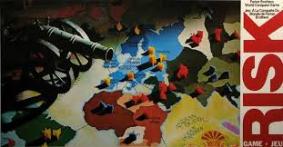

# Risk game designed for AI

## Ruleset

Rules are designed on the original Risk Game, but planning on having a few different configurations that can be callable from a config file.  The idea is to make any level of AI automation programmable and abilities to skip the corner cases that almost never come up (like attacking with less than maximal force).

## OpenAI Gym
This will be turned into an open AI environment that will be configurable.

## Bots
Each player gets a player_state and an action_space.  Player_state is an enum that describes what kind of action the player is deciding.  Action_space is continually updated based on the context of the player/board (any of these actions can be chosen).
Bot behavior will be created by overriding the virtual get_player_feedback function (Player class should never be instantiated, only Humans or Bots based on the Bot Template).

## Usage
Current usage is just running game.py (no argparse or config yet so configuration is just changing the dictionary in the main loop)

# Fix it list (roughly in order)

1) Implement fortification after attack (right now function is just pass)
2) Implement OpenAI gym environment
    - Refactor game code to move in steps
    - Steps start with a given input action, and run the game/simulation until a new observation state is generated (also calculates what the reward should be for that given step)
    - Game needs to have a generic step
    - In gym environment game loop/step is input action, run game logic to next action point, return observation space and reward.
3) Make sure player action_space is always updated
4) 
5) Print game summary
6) Batch game statistics (run N games, winners/draws of games)

- Make game_state for bot more organized

## Refactor plan for step
1) Create backup master branch - Done
2) Create new game loop (instantiate game and while not game.game_over game.game_step()) 
3) Create Game.step function (moves to next action based on game state)
4) Fill in step function with initialization
5) Add play_round to step function
6) Cut functions out of play_round and insert into step function (test play after inserts)
7) Create gym environment step function to move several steps to next gym_player turn

#Credits
Map and some plotting used from https://github.com/godatadriven/risk-analysis/
