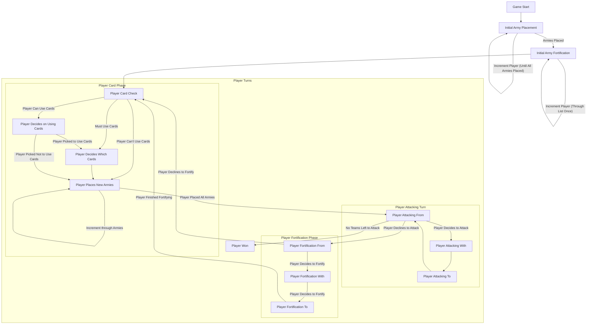

Game State diagram

Available Game States:
  - INITIAL_ARMY_PLACEMENT
  - INITIAL_ARMY_FORTIFICATION
  - PLAYER_CARD_CHECK
  - PLAYER_PLACE_NEW_ARMIES
  - PLAYER_ATTACKING
  - PLAYER_FORTIFICATION

Available Player States:
  - INITIAL_ARMY_PLACEMENT
  - INITIAL_ARMY_FORTIFICATION
  - PLAYER_CARD_CHECK
  - PLAYER_PLACE_NEW_ARMIES
  - PLAYER_ATTACKING_FROM
  - PLAYER_ATTACKING_WITH
  - PLAYER_ATTACKING_TO
  - PLAYER_MOVING_POST_WIN
  - PLAYER_FORTIFICATION_FROM
  - PLAYER_FORTIFICATION_WITH
  - PLAYER_FORTIFICATION_TO
  - PLAYER_CARD_PICK

Card States:
  - PLAYER_CANT_USE_CARDS
  - PLAYER_CAN_USE_CARDS
  - PLAYER_MUST_USE_CARDS

Game Outline

